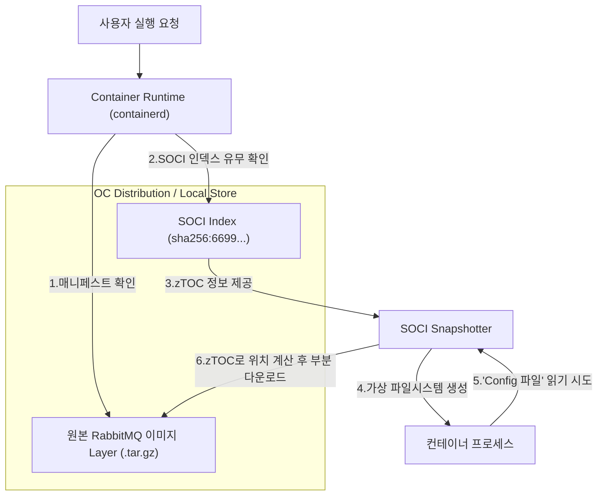

## SOCI Snapshotter
SOCI Snapshotter는 containerd의 플러그인으로 표준 OCI 이미지를 지연 로딩(lazy pulling) 방식으로 불러올 수 있다. SOCI는 전체 이미지를 미리 다운로드하지 않고 필요한 부분만 요청 시점에 가져오는 방식으로 동작한다. 이를 위해서 필요한 것이 기존 컨테이너 이미지에 대한 인덱스를 생성이다. 기존 이미지 + SOCI 덕분에 별도의 이미지 변환이 필요없는만큼 SBOM과 같은 공급망 투명성을 그대로 유지될수 잇다.


왼쪽은 기존의 컨테이너 이미지, 오른쪽은 컨테이너 이미지에 대한 soci 구조를 보여준다.


**기존 방식의 문제점**  
기존 컨테이너 실행 방식은 외부 이미지 레지스트리로부터 컨테이너 이미지 전체를 다운로드한 후 파일시스템으로 불러온다.  컨테이너 실행에 실제로 필요한 데이터는 전체의 6.4%에 불과하지만, 전체 이미지를 다운로드해야 하므로 시작 시간이 오래 걸린다는 단점이 있다.

**주요 장점**
- 컨테이너 시작 시간 단축
- 불필요한 데이터 다운로드 방지
- 추가적인 이미지 변환 불필요

**stargz-snapshotter 비교**
| 항목 | stargz-snapshotter | SOCI Snapshotter |
|---|---|---|
| 개발사 | Google / containerd 커뮤니티 | AWS |
| 핵심 방식 | 이미지를 eStargz 형식으로 변환 | 기존 이미지를 유지하고 별도의 인덱스 생성 |
| 이미지 다이제스트 | 변환 시 변경됨 (새 이미지 생성) | 변경되지 않음 (기존 이미지 그대로 사용) |
| 이미지 서명 | 재서명 필요 | 기존 서명 유지 가능 |
| 호환성 | eStargz 미지원 환경에서도 동작 가능 | 일반 OCI 이미지와 완벽 호환 |
| 주요 특징 | 최적화(Prefetch) 기능이 강력함 | CI/CD 파이프라인 변경 최소화 |

**설치 요구 사항**
- containerd >= 1.4
- nerdctl >= 1.6.0
- fuse
- sudo

### VM 기본 환경 설정

**Vagrant 생성 및 삭제**
```sh
vagrant up
vagrant ssh node1

# 테스트 종료 후 vm 정리
vagrant destroy -f && rm -rf .vagrant
```

**containerd 설치**
```sh
sudo dnf update -y 
sudo dnf install -y bash-completion vim git wget
sudo systemctl stop firewalld.service 

sudo dnf config-manager --add-repo https://download.docker.com/linux/rhel/docker-ce.repo
sudo dnf -y install docker-ce docker-ce-cli containerd.io docker-buildx-plugin docker-compose-plugin
sudo systemctl --now enable docker
systemctl status containerd

containerd --version
containerd containerd.io v2.2.1 dea7da592f5d1d2b7755e3a161be07f43fad8f75
```

**nerdctl 설치**
```sh
# 아키텍처 변수 정의
ARCH=$(rpm --eval '%{_arch}')
if [ "$ARCH" = "aarch64" ]; then
  BIN_ARCH="arm64"
else
  BIN_ARCH="amd64"
fi
echo "$BIN_ARCH"

wget https://github.com/containerd/nerdctl/releases/download/v2.2.1/nerdctl-2.2.1-linux-${BIN_ARCH}.tar.gz
tar -xvf nerdctl-2.2.1-linux-${BIN_ARCH}.tar.gz 
sudo mv nerdctl /usr/local/bin/

sudo nerdctl version
Client:
 Version:       v2.2.1
 OS/Arch:       linux/arm64
```

**soci-snapshotter 설치**
```sh
sudo dnf install -y fuse

version="0.12.1"
wget https://github.com/awslabs/soci-snapshotter/releases/download/v${version}/soci-snapshotter-${version}-linux-${BIN_ARCH}.tar.gz
sudo tar -C /usr/local/bin -xvf soci-snapshotter-${version}-linux-${BIN_ARCH}.tar.gz soci soci-snapshotter-grpc

sudo soci -v
soci version v0.12.1 c140af2f22fffade79af74ddcc1c29388d763051
```

**sudo bin 경로 추가**
```sh
sudo visudo -f /etc/sudoers.d/10-local-path
Defaults secure_path="/usr/local/sbin:/usr/local/bin:/usr/sbin:/usr/bin:/sbin:/bin"
```

### soci-snapshotter 예제
soci는 추가적으로 포맷을 가지고 있다. [호환되는 레지스트리 목록](https://github.com/awslabs/soci-snapshotter/blob/main/docs/registry.md#list-of-registry-compatibility) 경우에 따라서 이미지 레지스트리가 soci를 지원하지 않을 가능성도 검토해둔다.

```sh
export REGISTRY_USER=kwx4957
export REGISTRY_PASSWORD="password"
export REGISTRY=docker.io

# 이미지 레지스트리 로그인
# 1번은 이미지를 푸쉬하기 위함과 현재 유저로 soci 인덱스를 실행하기 위함이다.
# 2번은 루트 계정으로 soci 스냅샷터터를 실행하는데 필요하기 떄문이다.
echo $REGISTRY_PASSWORD | nerdctl login -u $REGISTRY_USER --password-stdin $REGISTRY
echo $REGISTRY_PASSWORD | sudo nerdctl login -u $REGISTRY_USER --password-stdin $REGISTRY

# 이미지 풀
# nerdctl은 dockerd 없이 containrd와 직접 통신하는 도구이다.
sudo nerdctl pull docker.io/library/rabbitmq:latest

# 기존 rabbitmq 이미지
sudo nerdctl images
REPOSITORY    TAG       IMAGE ID        CREATED           PLATFORM       SIZE       BLOB SIZE
rabbitmq      latest    5b268c2a05b9    13 seconds ago    linux/arm64    269.3MB    110.8MB

# SOCI를 생성하는 과정이다.
sudo soci convert docker.io/library/rabbitmq:latest $REGISTRY_USER/rabbitmq-soci:latest

# 상단의 soci를 생성하고 나서 2개의 이미지가 존재한다
# 첫 번째는 기존 이미지, 두 번째는 SOCI 인덱스 매니페스트이다. 이 덕분에 기존의 이미지를 변경하지 않고 이미지 서명을 그대로 유지한다.
sudo nerdctl images
REPOSITORY               TAG       IMAGE ID        CREATED           PLATFORM       SIZE       BLOB SIZE
kwx4957/rabbitmq-soci    latest    3e5d14a90d56    56 seconds ago    linux/arm64    269.3MB    110.8MB
kwx4957/rabbitmq-soci    latest    3e5d14a90d56    56 seconds ago    linux          0B         3.211MB
rabbitmq                 latest    5b268c2a05b9    12 minutes ago    linux/arm64    269.3MB    110.8MB

# 이미지 푸쉬
sudo nerdctl push $REGISTRY_USER/rabbitmq-soci:latest

# ztoc 정보 조회
sudo soci ztoc ls
DIGEST                                                                     SIZE       LAYER DIGEST     
sha256:46743d2d29c53e49781e4f57405c083b3026a23b09da5011422c3d5563b8da0d    946488     sha256:a0ddfc586f89c47409459e258c47a9588bfeae70dabcb161994d761997add2ac    
sha256:7108458c05094ac5300fc306b2341adce47a1724efc352ad9335ab0d969ca36a    1415464    sha256:36bf709aa36d66b784b0ba1aa3276848f28501175eeb4d7a310b1a98578f8558    
sha256:eeb5e868a643e9d0c62972dbfe64d197c5a0bd1c5b3afeb9e5665f265d061be1    847696     sha256:d69b0f83ee1832fef1a2d17569188ea0f644dcf82432ef6b0233764c9bdb45cf 

# ztoc 정보 출력
sudo soci ztoc info sha256:7108458c05094ac5300fc306b2341adce47a1724efc352ad9335ab0d969ca36a

# soci 인덱스 조회
sudo soci index list
sha256:6699288e86a28fc6a77af95d5df6be01925f6abcb1b69dbeefba1e8aa9d86470    1490    docker.io/kwx4957/rabbitmq-soci:latest    linux/arm64/v8    application/vnd.oci.image.manifest.v1+json    v2                  2m56s ago    

# soci 인덱스 정보 출력
sudo soci index info sha256:6699288e86a28fc6a77af95d5df6be01925f6abcb1b69dbeefba1e8aa9d86470
{
  "schemaVersion": 2,
  "mediaType": "application/vnd.oci.image.manifest.v1+json",
  "config": {
    "mediaType": "application/vnd.amazon.soci.index.v2+json",
    "digest": "sha256:44136fa355b3678a1146ad16f7e8649e94fb4fc21fe77e8310c060f61caaff8a",
    "size": 2
  },
.....
  "annotations": {
    "com.amazon.soci.build-tool-identifier": "AWS SOCI CLI v0.2"
  }
}

# soci-snapshotter 활성화
sudo systemctl stop containerd

# containerd 설정파일 최하단에 새로 추가해준다. 
sudo vi /etc/containerd/config.toml
[proxy_plugins]
  [proxy_plugins.soci]
    type = "snapshot"
    address = "/run/soci-snapshotter-grpc/soci-snapshotter-grpc.sock"

sudo systemctl restart containerd

sudo systemctl status containerd.service 

# 설정 조회
# soci 플러그인을 사용하는 것을 확인할 수 있다.
sudo nerdctl system info | grep -i plugins -A 2
Plugins:
  Log:     fluentd journald json-file none syslog
  Storage: native overlayfs soci

# soci-snapshotter 시작 
sudo soci-snapshotter-grpc 2> ~/soci-snapshotter-errors 1> ~/soci-snapshotter-logs &

# ztoc 레이저 정보 확인
mount | grep fuse
fusectl on /sys/fs/fuse/connections type fusectl (rw,nosuid,nodev,noexec,relatime)

sudo nerdctl pull --snapshotter soci $REGISTRY_USER/rabbitmq-soci:latest
docker.io/kwx4957/rabbitmq-soci:latest:                                           resolved       |++++++++++++++++++++++++++++++++++++++| 
index-sha256:958baa031f995a45fb0b0858db2f4500392bd2bb9634d4280e6e0041062f4db9:    done           |++++++++++++++++++++++++++++++++++++++| 
manifest-sha256:dbae5afea1445cfffc96ce490041b1141b0a45402f59df752ed38d827ed77350: exists         |++++++++++++++++++++++++++++++++++++++| 
config-sha256:db900fceec69f7ea0a1935a0ddffaae1bd21ee4c40b610d66b318494a8367521:   exists         |++++++++++++++++++++++++++++++++++++++| 

# ztoc 레이저 정보 확인
# 이전과는 다르게 3개의 이미지 레이어가 존재한다.
mount | grep fuse
soci on /var/lib/soci-snapshotter-grpc/snapshotter/snapshots/1/fs type fuse.rawBridge (rw,nodev,relatime,user_id=0,group_id=0,allow_other,max_read=131072)
soci on /var/lib/soci-snapshotter-grpc/snapshotter/snapshots/2/fs type fuse.rawBridge (rw,nodev,relatime,user_id=0,group_id=0,allow_other,max_read=131072)
soci on /var/lib/soci-snapshotter-grpc/snapshotter/snapshots/5/fs type fuse.rawBridge (rw,nodev,relatime,user_id=0,group_id=0,allow_other,max_read=131072)

# 컨테이너 실행
sudo nerdctl run --snapshotter soci --net host --rm $REGISTRY_USER/rabbitmq-soci:latest
```

### soci 구조
정확한 구조를 이해하기 위해 탑다운 방식으로 접근해보자. 
1. soci 인덱스
2. ztoc
3. zInfo

동작 과정
1. 애플리케이션이 파일을 읽고자 요청을 보낸다.
2. soci Snapshotter가 zTOC를 조회한다. zTOC에는 요청한 파일이 위치힌 레이어를 찾는다.
3. 레지스트리로부터 해당 레이어에 대한 정보를 다운받고, 파일시스템에 로드한다.
4. 애플리케이션이 요청에 대해 응답한다.



```sh
# soci index 생성, 만일 이전에 해당 작업을 수행했다면 생략 가능
sudo nerdctl pull docker.io/library/rabbitmq:latest
sudo nerdctl images
sudo soci convert docker.io/library/rabbitmq:latest $REGISTRY_USER/rabbitmq-soci:latest

# SOCI 인덱스 목록 조회
sudo soci index ls
sha256:6699288e86a28fc6a77af95d5df6be01925f6abcb1b69dbeefba1e8aa9d86470    1490    kwx4957/rabbitmq-soci:latest    linux/arm64/v8    application/vnd.oci.image.manifest.v1+json    v2                  1m1s ago    


# SOCI 인덱스 정보를 조회하면 layers에 배열이 존재한다. 배열이 바로 zTOC이다. 
sudo soci index info sha256:6699288e86a28fc6a77af95d5df6be01925f6abcb1b69dbeefba1e8aa9d86470
{
  "schemaVersion": 2,
  "mediaType": "application/vnd.oci.image.manifest.v1+json",
  "config": {
    "mediaType": "application/vnd.amazon.soci.index.v2+json",
    "digest": "sha256:44136fa355b3678a1146ad16f7e8649e94fb4fc21fe77e8310c060f61caaff8a",
    "size": 2
  },
  
  # zTOC 레이어, 총 3개로 이루어져 있다.
  "layers": [
    {
      "mediaType": "application/octet-stream",
      # zToc 레이저 
      "digest": "sha256:7108458c05094ac5300fc306b2341adce47a1724efc352ad9335ab0d969ca36a",
      "size": 1415464,
      "annotations": {
        "com.amazon.soci.image-layer-digest": "sha256:36bf709aa36d66b784b0ba1aa3276848f28501175eeb4d7a310b1a98578f8558",
        "com.amazon.soci.image-layer-mediaType": "application/vnd.oci.image.layer.v1.tar+gzip",
        "com.amazon.soci.span-size": "4194304"
      }
    },
    {
      "mediaType": "application/octet-stream",
      # zToc 레이저 
      "digest": "sha256:eeb5e868a643e9d0c62972dbfe64d197c5a0bd1c5b3afeb9e5665f265d061be1",
      "size": 847696,
      "annotations": {
        "com.amazon.soci.image-layer-digest": "sha256:d69b0f83ee1832fef1a2d17569188ea0f644dcf82432ef6b0233764c9bdb45cf",
        "com.amazon.soci.image-layer-mediaType": "application/vnd.oci.image.layer.v1.tar+gzip",
        "com.amazon.soci.span-size": "4194304"
      }
    },
    {
      "mediaType": "application/octet-stream",
      # zToc 레이저 
      "digest": "sha256:46743d2d29c53e49781e4f57405c083b3026a23b09da5011422c3d5563b8da0d",
      "size": 946488,
      "annotations": {
        "com.amazon.soci.image-layer-digest": "sha256:a0ddfc586f89c47409459e258c47a9588bfeae70dabcb161994d761997add2ac",
        "com.amazon.soci.image-layer-mediaType": "application/vnd.oci.image.layer.v1.tar+gzip",
        "com.amazon.soci.span-size": "4194304"
      }
    }
  ],
  "annotations": {
    "com.amazon.soci.build-tool-identifier": "AWS SOCI CLI v0.2"
  }
}

# 앞선 인덱스와 일치하는 3개의 ztoc이 동일하게 존재한 것을 확인할 수 있다.
# 7108458c05094ac5300fc306b2341adce47a1724efc352ad9335ab0d969ca36a
# eeb5e868a643e9d0c62972dbfe64d197c5a0bd1c5b3afeb9e5665f265d061be1
# 46743d2d29c53e49781e4f57405c083b3026a23b09da5011422c3d5563b8da0d
sudo soci ztoc ls
sha256:7108458c05094ac5300fc306b2341adce47a1724efc352ad9335ab0d969ca36a    1415464    sha256:36bf709aa36d66b784b0ba1aa3276848f28501175eeb4d7a310b1a98578f8558    
sha256:eeb5e868a643e9d0c62972dbfe64d197c5a0bd1c5b3afeb9e5665f265d061be1    847696     sha256:d69b0f83ee1832fef1a2d17569188ea0f644dcf82432ef6b0233764c9bdb45cf    
sha256:46743d2d29c53e49781e4f57405c083b3026a23b09da5011422c3d5563b8da0d    946488     sha256:a0ddfc586f89c47409459e258c47a9588bfeae70dabcb161994d761997add2ac 
---   
sha256:11c19b60a43268feceb3724a239df1ffe748df694b04435153ba3bdd18116574    2795888    sha256:c9b629762372f548de0ebccf01b8e80ae5ce251dfd36aef6fc3ae8d963493edf    
sha256:2b7beb0425cac007134dc61ebcbd6e998a48dd4b1727404b40388b7ab8fe9934    871640     sha256:599d5b6b6766fd729045e2e7d0396d1f61fe41c612d4aef6bb3bf5ea7db12ae2    
sha256:b55cbdc913060898ec9009bd19aaed6c053a9b15500a10f249f89d0f569deb90    2087984    sha256:c74c1b58c0fec38e5e1693ef11d4e66584ad3cdcce803b19641e648d655ae137    
sha256:d82dc61f10b30478c0fd487d3e3a1c9f74cbda06e26142c22fdbc34b8cd26524    3106472    sha256:9dbf0b8a807c2eba959326591a264b2e464d70f28bdb151bfa8892097a09d6ab    
sha256:fddae75348af34e01d7ee2f9194c081201b1f8e21478b87338a12a9f71b233fb    4674216    sha256:243a2f381e4cd3963e3af5194953e3e2807c452e833bf69397dee70610e428e6 


# 인덱스와 연관된 ztoc 조회, soci가 한개뿐이라 정확한 차이를 알수 없음
# sudo soci index list sha256:6699288e86a28fc6a77af95d5df6be01925f6abcb1b69dbeefba1e8aa9d86470 —ref

# zinfo 조회
# 최상단의 이미지와 같이 파일 정보, start_span, end_span으로 구성되어있다. 
sudo soci ztoc info sha256:11c19b60a43268feceb3724a239df1ffe748df694b04435153ba3bdd18116574 
    {
      "filename": "var/lib/systemd/deb-systemd-user-helper-enabled/ssh-agent.socket.dsh-also",
      "offset": 196013568,
      "size": 56,
      "type": "reg",
      "start_span": 46,
      "end_span": 46
    },
    {
      "filename": "var/log/apt/",
      "offset": 196022784,
      "size": 0,
      "type": "dir",
      "start_span": 46,
      "end_span": 46
    },
...

# 하단의 명령은 ztoc 레이어의 내부 파일을 읽는 명령어다. 기본값은 표준 출력이다.
sudo soci ztoc get-file --help
sudo soci ztoc get-file sha256:11c19b60a43268feceb3724a239df1ffe748df694b04435153ba3bdd18116574 var/log/apt/term.log
Setting up libsvn1:arm64 (1.14.5-3) ...
Setting up mercurial-common (7.0.1-2) ...
Setting up subversion (1.14.5-3) ...
Setting up liberror-perl (0.17030-1) ...
Setting up git (1:2.47.3-0+deb13u1) ...
Setting up mercurial (7.0.1-2) ...
...
```

### soci-snapshotter 테스트 
기존의 이미지 실행속도와 soci 실행속도가 얼마나 차이가 나는지 비교해보기로 했다. 이를 위해서 go 프레임워크인 echo를 사용했으며 비효율을 위해 최적화가 되지 않은 go 언어 기반의 약 860MB 크기의 이미지를 사용했다.

AWS의 공식 문서에는 약 실행시간까지 `50%`가 개선되었다고 한다. 직접 테스트한 결과 기존 이미지는 실행까지 약 21.6초가 걸리는 반면에, SOCI는 실행까지 11.7초가 걸렸다. 이는 `45.8%`가 개선된 것으로 보인다. 공식문서에서 말하는 개선 속도와 거의 차이가 없는 것으로 보인다. 하지만 반복된 횟수로 시간 측정을 하지 않은만큼 여러 변수가 통제되지 않아 정확하지 않을수 있지만 유의미한 결과가 있을 것으로 보인다. 

```sh
# 이미지 삭제 
sudo docker rm -f echo 
sudo docker rmi kwx4957/echo
sudo docker system prune -a --volumes

cat << 'EOF' > check_running_time.sh
#!/bin/bash
# 시작시간 체크
REGISTRY_USER=kwx4957
START_TIME=$(date +%s.%N)

# 컨테이너 실행
docker run -d --name echo -p 1323:1323 $REGISTRY_USER/echo 

# 0.1초마다 헬스체크
echo "Wating for app to respond..."
until [ "$(curl -s -o /dev/null -w "%{http_code}" http://localhost:1323)" -eq 200 ]; do
    printf '.'
    sleep 0.1
done

# 종료 시간 저장
END_TIME=$(date +%s.%N)

# 실행시간 계산
RUN_TIME=$(echo "$END_TIME - $START_TIME" | bc)
echo -e "\n총 소요 시간 (다운로드 포함): $RUN_TIME 초"
EOF
chmod +x check_running_time.sh

sudo ./check_running_time.sh
총 소요 시간 (다운로드 포함): 21.639856036 초

# 이미지 PULL, 변환 후 push
sudo nerdctl pull $REGISTRY_USER/echo
sudo soci convert docker.io/$REGISTRY_USER/echo:latest $REGISTRY_USER/echo-soci:latest
sudo nerdctl push $REGISTRY_USER/echo-soci:latest

# 오류 발생으로 재태그하여 푸쉬
# sudo nerdctl tag kwx4957/echo-soci:latest kwx4957/echo-soci:fixed
# sudo nerdctl push kwx4957/echo-soci:fixed

# 기존 컨테이너, 이미지 삭제
sudo nerdctl rm -f $(sudo nerdctl ps -aq)
sudo nerdctl rmi -f $(sudo nerdctl images -q)
sudo soci index list
sudo soci index list -q | xargs -r sudo soci index rm
sudo nerdctl system prune -a --volumes 

cat << 'EOF' > check_running_time.sh
#!/bin/bash
# 시작시간 체크
REGISTRY_USER=kwx4957
START_TIME=$(date +%s.%N)

# 컨테이너 실행
sudo nerdctl run -d --snapshotter soci --net host -p 1323:1323 $REGISTRY_USER/echo-soci:fixed

# 0.1초마다 헬스체크
echo "Waiting for app to respond..."
until [ "$(curl -s -o /dev/null -w "%{http_code}" http://localhost:1323)" -eq 200 ]; do
    printf '.'
    sleep 0.1
done

# 종료 시간 저장
END_TIME=$(date +%s.%N)

# 실행시간 계산
RUN_TIME=$(echo "$END_TIME - $START_TIME" | bc)
echo -e "\n총 소요 시간 (다운로드 포함): $RUN_TIME 초"
EOF
chmod +x check_running_time.sh

sudo ./check_running_time.sh

총 소요 시간 (다운로드 포함): 11.763327197 초
```


[Ref]  
https://github.com/containerd/nerdctl     
https://github.com/awslabs/soci-snapshotter/blob/main/docs/getting-started.md     
https://aws.amazon.com/ko/blogs/korea/aws-fargate-enables-faster-container-startup-using-seekable-oci/  


## TroubelShoot
1. soci sanpshotter 이미지 찾지않음  
문서와 다르게 `mount | grep fuse` 실행 시 이미지가 출력되지 않는다. 반면에 다른 환경에서 실행 시에는 바로 이미지가 출력되기에 2원인은 알수없으나 변환 또는 이미지 레지스트리에 푸쉬하는 과정에서 에러가 발생한 것으로 보인다.
```sh
sudo systemctl restart containerd

sudo nerdctl rmi -f $(sudo nerdctl images -q)

sudo soci index list
sudo soci index list -q | xargs -r soci index rm
sudo systemctl restart containerd

sudo nerdctl run --snapshotter soci --net host --rm $REGISTRY_USER/rabbitmq-soci:latest

mount | grep fuse
fusectl on /sys/fs/fuse/connections type fusectl (rw,nosuid,nodev,noexec,relatime)
soci on /var/lib/soci-snapshotter-grpc/snapshotter/snapshots/24/fs type fuse.rawBridge (rw,nodev,relatime,user_id=0,group_id=0,allow_other,max_read=131072)
soci on /var/lib/soci-snapshotter-grpc/snapshotter/snapshots/25/fs type fuse.rawBridge (rw,nodev,relatime,user_id=0,group_id=0,allow_other,max_read=131072)
soci on /var/lib/soci-snapshotter-grpc/snapshotter/snapshots/28/fs type fuse.rawBridge (rw,nodev,relatime,user_id=0,group_id=0,allow_other,max_read=131072)
```

2. sudo command not found  
일반 사용자는 `/usr/local/bin` 경로의 명령어를 실행하지만 sudo으로 실행하면 command not found가 발생한다. sudo가 기본적으로 제한된 PATH만을 사용하기 때문이다.
즉 해당 문제를 해결하기 위해서는 sudo가 참조하는 파일의 경로인 `/etc/sudoers`의 `secure_path` 경로를 추가해줘야 한다. rocky 기준으로 이러한 설정을 지정한 이유는 PATH 하이재킹을 방지하기 위한 목적이다.
```sh
sudo visudo -f /etc/sudoers.d/10-local-path
Defaults secure_path="/usr/local/sbin:/usr/local/bin:/usr/sbin:/usr/bin:/sbin:/bin"
```

3. nexus repository 지원하지 않음